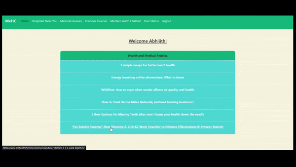

# MeHC [Medical Healthcare Application]
**MeHC** your ultimate companion for comprehensive health and wellness! It provides you with up to date health and medical articles, ensuring you stay well-informed about the world of healthcare.
From resolving medical queries with efficiency to suggesting nearby hospitals for immediate care, MeHC is your go-to resource for all things health-related.
The application also assesses your interaction with both the bots to gauge your mental health status as well.


- - - -
### Techstack
| Frontend |   |
| --- | --- |
| Backend |  |
- - - -
### Functionalities
* User Login/Registration/Logout functionalities.
* Homepage with relevant daily health and medical articles scraped from top health/medical sites.
* Finding nearby hospitals on allowing geolocation access to your location and displaying it on a constructed map.
* Conversations with MedGPT (ChatGPT 3.5 turbo) which answers only Medical Queries by using a simple filter.
* Conversations with MeHC Chatbot for mental health to assess and understand your mental conditions.
* Viewing previous chats with MedGPT for perfesonal reference or other uses.
* User Status of their mental health via a graph using sentiment analysis of their conversations with the chatbot and suggesting them how to go about their mental health.
- - - -
### Project Setup
You can setup all the files via the clone command using the link:
```
https://github.com/AAbhijithA/MeHC.git
```
***(Note: Ensure you have python downloaded on your system to run this, if not download from here: [Download Python](https://www.python.org/downloads/))***

All the necessary libraries are listed in the **requirements.txt** file so you can download them using the command:
```
pip install -r requirements.txt
```
***(Note: You can so the above in a virtual environment set up in your directory, more details on setup and activation here: [Virtual Environment](https://docs.python.org/3/library/venv.html#how-venvs-work))***
```
Ensure you use your environment variables or secrets to the key for your API's in the given .env file for deployment
```
You can then run your application by the following command:
```
python app.py
```
- - - -
### Chatbot Model Training and Saving
The information related to training the chatbot can be found in the 'MODEL_Train' folder.

Click this link to redirect yourself there: [Model Training and Saving](https://github.com/AAbhijithA/MeHC/tree/master/Model_Train)
- - - -
### Built With
* **HTML | Bootstrap-CSS | JavaScript:** For the frontend of the web-application.
* **ChartJs:** For the display of the chart regarding status of the user.
* **Python:** Backend programming language.
* **BeautifulSoup:** For scraping relevant links and info of multiple sites for up-to-date articles.
* **Folium:** For constructing the map of nearby hospitals with the help of LeafletJs.
* **Geoapify API:** Using Places-API for receiving hospitals radially nearby users location.
* **NLTK:** For pre-processing the data we train the model with.
* **Numpy:** For pre-processing the data before giving it to the model to train with.
* **Tensorflow:** For training the Chatbot model and reusing them by loading them later.
* **Pickle:** Saving/Opening the files of pre-processed data and trained model.
* **Flask:** Web-Application microframework in python.
* **SQLite:** Serverless database used for storing user information.
* **OpenAI API:** Using ChatGPT only for medical queries using a simple filter.
* **TextBlob:** using NLP for sentiment ploarity of chat conversations with chatbot for later use.
- - - -
### Author
**Abhijith Ajith :** [AAbhijithA](https://github.com/AAbhijithA)
